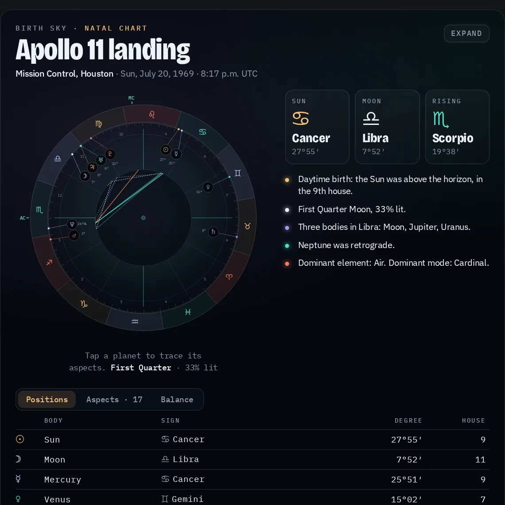
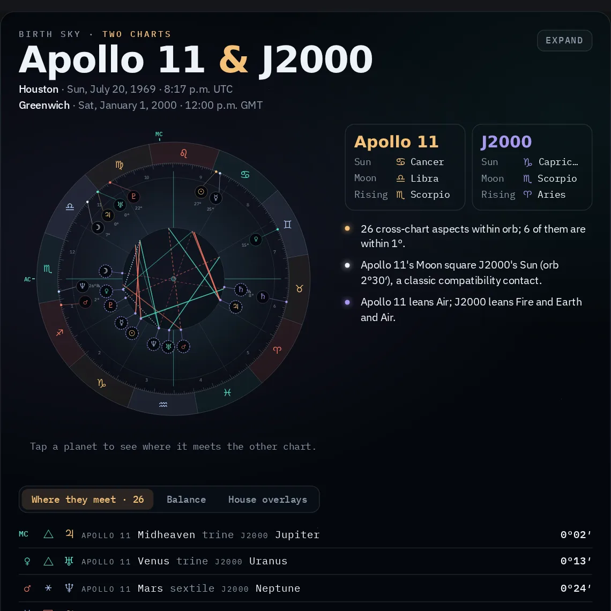

# Birth Sky MCP server

An MCP server for birth charts. It computes where the Sun, Moon and planets were at any moment from 1900 to 2100: signs, rising sign, houses, aspects, chart comparisons, transits and sky events. A built-in ephemeris does the work, so there are no API keys and no network calls.

In clients that support [MCP Apps](https://github.com/modelcontextprotocol/ext-apps) (Claude, ChatGPT, VS Code and others), the chart tools also draw an interactive chart wheel in the Sushir 3D Studio style. Other clients get the same reading as text.



## Tools

| Tool | What it answers | View |
|---|---|---|
| `birthsky_compute_chart` | A full natal chart: positions, rising sign and Midheaven, equal or whole-sign houses, aspects (applying or separating), element and mode balance, Moon phase, and plain-language highlights such as "the Moon had entered Gemini only 41 minutes earlier". | Chart wheel |
| `birthsky_get_sky` | The sky at a moment (default: now), plus sign changes, stations and lunations in the next 0–90 days. | Sky wheel |
| `birthsky_compare_charts` | Two charts compared: cross-chart aspects, shared signs, house overlays and element balance. | Two-ring wheel |
| `birthsky_find_transits` | Exact dates when moving planets aspect natal points in a date range, such as a Saturn return. Retrograde passes are counted. Results are paged. | — |
| `birthsky_find_events` | Sign ingresses, retrograde and direct stations, and the four Moon phases, with eclipses flagged. Results are paged. | — |

All tools are read-only. Each returns Markdown by default, or JSON with `response_format: "json"`, and always includes the full result in `structuredContent`.

### Giving a birth time

- `date` is `YYYY-MM-DD` and `time` is the 24-hour local clock (`"18:45"` for 6:45 p.m.).
- `timezone` takes an IANA name such as `America/Chicago`. The server applies that zone's historical rules (daylight saving, war time, old offsets), so Chicago in July 1999 resolves to CDT (UTC−5) and Mexico City in 1970 to UTC−6. Use `utc_offset` in hours when only the offset is known.
- `latitude` is north-positive and `longitude` is **east-positive**, so places in the Americas have negative longitudes. Both are needed for the rising sign, Midheaven and houses.



## Run it

```bash
npm install
npm run build
```

**Claude Code**

```bash
claude mcp add birth-sky -- node /absolute/path/to/mcp/birth-sky-mcp-server/dist/index.js
```

**Claude Desktop** (`claude_desktop_config.json`)

```json
{
  "mcpServers": {
    "birth-sky": { "command": "node", "args": ["/absolute/path/to/mcp/birth-sky-mcp-server/dist/index.js"] }
  }
}
```

**Streamable HTTP.** `TRANSPORT=http PORT=3000 npm start` serves stateless JSON at `http://127.0.0.1:3000/mcp`. DNS-rebinding protection only accepts `localhost` and `127.0.0.1` Host headers. Add your own host names with `ALLOWED_HOSTS=example.com:443` when you run it behind a proxy.

## The chart view

`ui/chart-view.html` is served as `ui://birth-sky/chart-view.html` with the MIME type `text/html;profile=mcp-app`. At build time the MCP Apps runtime is inlined into it, so the view loads no scripts. Its only network requests are for Google Fonts, which the resource declares in its CSP `resourceDomains`; if a host blocks them, it falls back to system fonts.

- The wheel is turned so the Ascendant sits on the left. Planets sweep from the Ascendant to their places when the view opens.
- Crowded planets are spread apart, with leader lines to their exact degrees.
- Tapping a planet, or its row in the table, traces its aspects. Tabs switch between positions, aspects, balance, upcoming events and house overlays.
- Reduced-motion settings turn the animation off, and hosts that offer fullscreen get an Expand button.

## Accuracy

Positions come from Paul Schlyter's low-precision planetary theory. Measured against PyEphem from 1900 to 2100, they are within about 2′ for the Sun and Moon and within about 6′ for the planets, Pluto being the worst case. Event times are within roughly 15 minutes for the Moon. For slow planets they can be off by a few hours, because the planet barely moves near a station. The zodiac is tropical and positions are geocentric. Placidus houses are not supported.

## Development

```bash
npm test          # builds, then drives the server through a real MCP client over stdio and HTTP
```

The tests:

- check positions against PyEphem for two reference moments;
- check historical time zones, error messages, the Mercury stations and eclipses of 2024, a Saturn return, paging, comparisons, the view resource, and DNS-rebinding protection on the HTTP transport.

`evaluation.xml` holds ten verified question–answer pairs for the [mcp-builder](https://github.com/anthropics/skills) evaluation harness.
